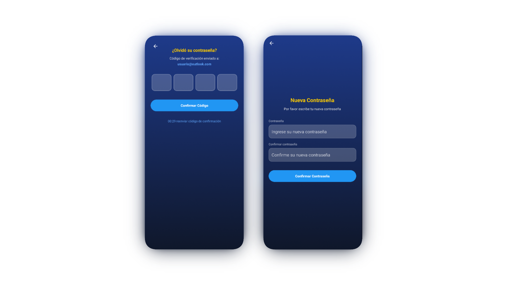
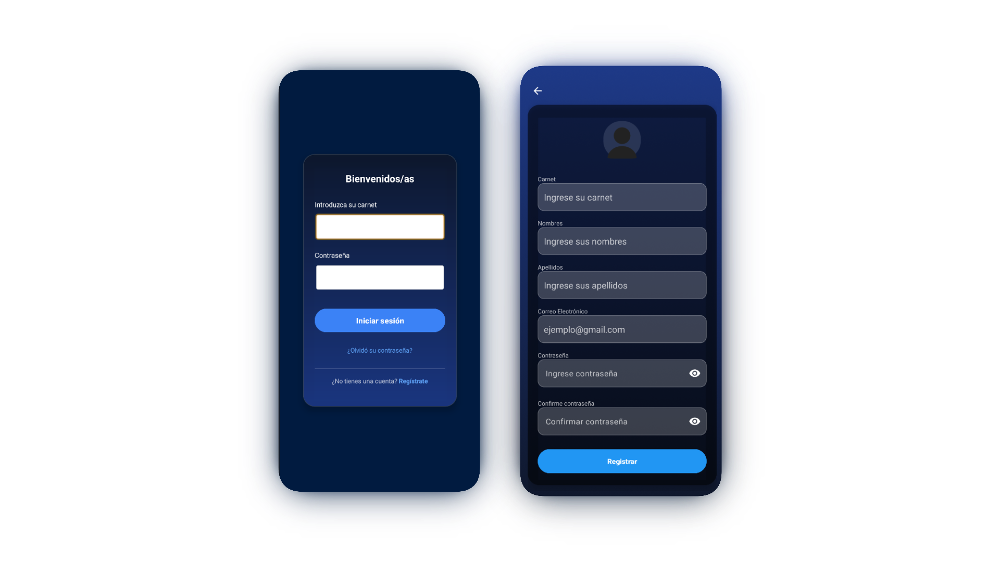
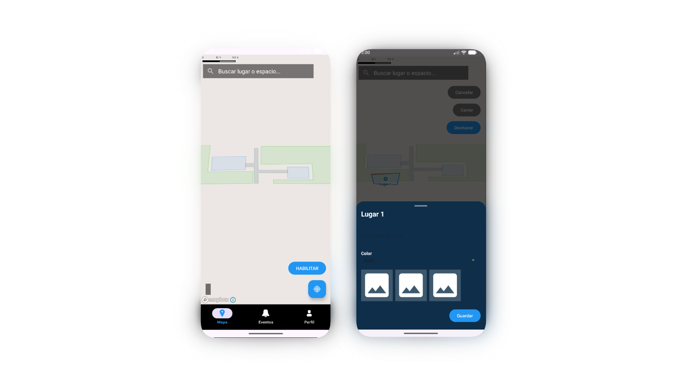
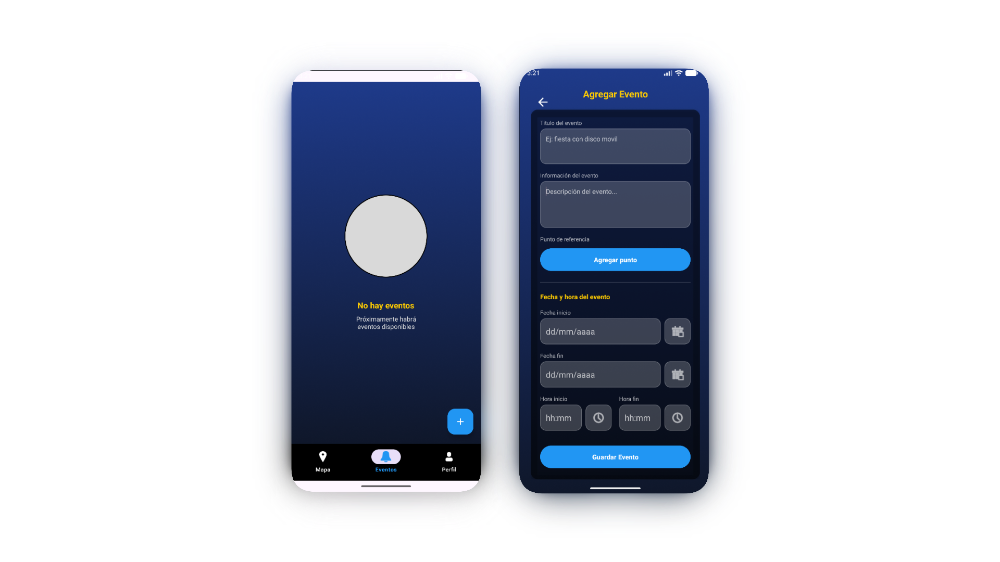
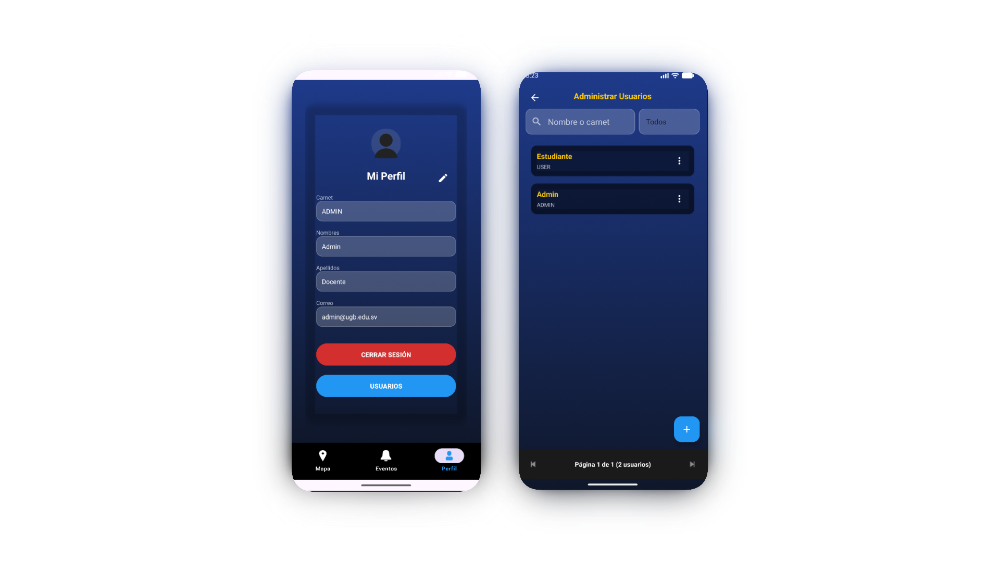

<h1>IndoorView</h1>

**IndoorView** — Navegación interior, Mapeo de Espacios & Gestión de Eventos

 

 

IndoorView es una aplicación nativa para Android diseñada para facilitar la navegación y mapeo de espacios interiores (Indoor Mapping). Permite la visualización geográfica de lugares, pisos y espacios utilizando polígonos, integrando además funcionalidades de gestión de eventos, roles de usuario y notificaciones.

---

## Stack Principal y Configuración del Proyecto

El proyecto está configurado bajo los estándares modernos de compilación en el ecosistema Android:

* **Lenguaje Principal:** Java 11.
* **Configuración de Compilación:** Scripts basados en Gradle Kotlin DSL (`build.gradle.kts`, `settings.gradle.kts`).
* **SDK y Compatibilidad:**
    * API Mínima: `26` (Android 8.0 Oreo).
    * SDK Objetivo (Target SDK): `36`.

---

## Dependencias del Proyecto

El proyecto se apoya en diversas librerías de terceros (definidas en `build.gradle.kts` y `libs.versions.toml`) para resolver lógicas complejas:

* **Mapbox SDK (`11.21.0`):** Motor base para el renderizado de mapas nativos.
* **Mapbox SDK Turf (`7.10.0`):** Utilidad espacial para evaluar colisiones y ubicaciones (punto dentro de un polígono).
* **Firebase (Firestore y Storage):** Plataforma principal para la sincronización de la base de datos en la nube y persistencia general (`FirebaseHelper.java`).
* **Cloudinary:** Servicio integrado para la gestión, optimización y alojamiento de recursos multimedia (`CloudinaryHelper.java`).
* **WorkManager (`2.9.0`):** Orquestación nativa de tareas asíncronas en segundo plano.
* **BCrypt (`0.10.2`):** Implementación local para el hasheo y salting de contraseñas.
* **OkHttp (`4.11.0`):** Cliente HTTP para interceptar y despachar peticiones hacia instancias CouchDB.
* **Gson (`2.10.1`):** Serialización y deserialización de las respuestas JSON del servidor a objetos Java.
* **JavaMail API (`1.6.7`):** Módulos `android-mail` y `android-activation` para despacho de correos nativos (SMTP).
* **Componentes UI/UX:** `Material Design 1.12.0`, `Navigation Component 2.7.7` (Fragment KTX/UI KTX), `ViewPager 1.0.0` y `CardView 1.0.0`.

---

## Arquitectura de Datos (Offline-First)

La aplicación implementa un enfoque *Offline-first*, permitiendo operar localmente y sincronizar en segundo plano.

### Almacenamiento Local y Servidor Remoto
1.  **SQLite Integrado:** La base de datos inicial está empaquetada junto al APK. En el primer inicio, el sistema extrae y utiliza la base de datos precompilada ubicada en `app/src/main/assets/databases/db_indoorView_pruebas.db` mediante un gestor nativo (`Database.java`).
2.  **Sincronización Principal (Firebase):** Toda la lógica central de negocio (usuarios, eventos, roles, etc.) se sincroniza hacia la nube utilizando **Google Firebase (Firestore y Storage)** a través de la clase `FirebaseHelper.java`.
3.  **Demostración Local (CouchDB):** De manera aislada, existe una implementación de prueba enfocada **exclusivamente en el apartado del mapa**. Se encarga de consumir las topologías y geometrías desde instancias locales de CouchDB (`ProcesadorDatosCouchDB.java`). Esto funge como una demo del mapeo y no interfiere con la lógica general en Firebase.

### Modelo de Datos Jerárquico
El dominio espacial de la aplicación está estrictamente normalizado de manera jerárquica en las clases del paquete `models`:
* **`Lugar` (`LugarCouchDB`)**: Entidad raíz, representa la instalación o edificio principal (ej. campus, complejo).
* **`Piso` (`PisoCouchDB`, `Pisos`)**: Representa un nivel estructural dentro de un `Lugar`.
* **`Espacio` (`EspacioCouchDB`)**: Delimitación de un área específica dentro de un `Piso` (aulas, oficinas, pasillos).
* **`Geometria` (`GeometriaCouchDB`)**: Contiene la topología y coordenadas matemáticas exactas que dibujan el `Espacio` en el mapa de renderizado.

---

## Mapeo, GIS y Operaciones Espaciales

El núcleo visual y lógico para la representación de interiores se maneja de manera especializada:

* **Mapbox SDK v11:** Motor principal utilizado en el `MapManager.java` y los fragmentos/actividades asociadas (`MapaFragment.java`, `MapaEventoActivity.java`) para el renderizado vectorial del plano *indoor*.
* **Turf.js para Android:** Empleado para operaciones de Sistemas de Información Geográfica (GIS) en el dispositivo. Es crucial para el análisis de relaciones espaciales, como calcular las colisiones, contención espacial y validaciones de tipo *Point-in-Polygon* al interactuar con los `Espacios` y `Geometrias`.

---

## Procesos en Segundo Plano y Sincronización

Para mantener la información fluida sin bloquear el hilo de la interfaz de usuario (UI), la app emplea **WorkManager**:
* `MapaSyncWorker.java`: Tarea programada en segundo plano encargada de actualizar la topología con la fuente de verdad (CouchDB).
* `EventosSyncWorker.java` / `EventosTommorowWorker.java`: Se encargan de validar fechas locales con las remotas y notificar al usuario sobre eventos inminentes.

---

## Flujo de Recuperación de Contraseña

La aplicación cuenta con un flujo nativo para reestablecer contraseñas (`OlvidoContraActivity.java`) utilizando envío de correos sin intermediarios, apoyándose en la librería **JavaMail API** (`EmailHelper.java`).

El flujo lógico opera de la siguiente manera:
1. **Validación y Generación de Código:** El usuario ingresa su correo en la interfaz (se valida su formato con RegEx e incluye una advertencia si no utiliza un dominio institucional). Acto seguido, la app genera de manera local un código OTP (One-Time Password) numérico aleatorio de 4 dígitos.
2. **Almacenamiento Temporal Seguro:** Este código, junto con el correo y una marca de tiempo, se guarda localmente en un archivo cifrado de `SharedPreferences` llamado `reset_password`. El código tiene un tiempo de expiración riguroso de 5 minutos (calculado vía `System.currentTimeMillis()`).
3. **Despacho Asíncrono del Correo:** Para no congelar el hilo principal de la interfaz gráfica, el envío del correo se delega a un `ExecutorService` (Single Thread) en segundo plano.
4. **Negociación SMTP (JavaMail):** `EmailHelper.java` configura una sesión autenticada con el servidor `smtp.gmail.com` por el puerto `587` usando TLS (`STARTTLS`). Consume las credenciales locales extraídas de la clase `EmailKeys` (`CORREO_REMITENTE` y `CONTRASENA_APP`).
5. **Evasión de Filtros Anti-Spam:** El correo se estructura deliberadamente como texto plano simple y su asunto ("Codigo de acceso - IndoorView") omite acrónimos institucionales sospechosos y enlaces web para maximizar la tasa de entrega en la bandeja principal del usuario.

---

## Seguridad y Configuración de Red

* **Cifrado de Contraseñas:** Se hace uso de la función de derivación de claves criptográficas de un solo sentido **BCrypt** para cifrar y verificar localmente las credenciales del usuario antes del almacenamiento o sincronización en la base de datos (SQLite).
* **Tráfico en Texto Claro:** Dentro del `AndroidManifest.xml` está declarada la bandera `usesCleartextTraffic="true"`. Esto está habilitado debido a la necesidad de sincronizar con nodos o entornos de servidores internos/CouchDB que no cuentan con un túnel TLS/SSL configurado actualmente.
* **Validaciones (OTP):** Se cuenta con un flujo seguro en `CodigoVerificacionActivity.java` para reestablecer contraseñas (`NuevaContraActivity.java`).

---

## Navegación, Diseño y UX

El flujo de usuario (UX) está centralizado y diseñado para permitir accesibilidad a mapas y eventos de manera intuitiva.

* **Estructura de Navegación Principal:**
    La `MainActivity` orquesta una barra de navegación inferior (Bottom Navigation a partir de `bottom_nav_menu.xml`) que intercambia entre los tres pilares de la app:
    1.  `EventosFragment`: Listado iterativo (basado en `RecyclerView` usando `EventosAdapter`) y `fragment_eventos_vacio.xml` para estados sin datos.
    2.  `MapaFragment`: Visor geoespacial central.
    3.  `PerfilFragment`: Gestión de la sesión y datos del usuario (`bg_campo_perfil.xml`).
* **Componentes de Interfaz y Experiencia (UI/UX):**
    * **Bottom Sheets Interactivas:** Uso intensivo de flujos no intrusivos emergentes desde abajo (`bottom_sheet_detalle_lugar.xml`, `bottom_sheet_detalle_lugarespacio_crud.xml`) para visualizar metadatos de un polígono seleccionado.
    * **Imágenes Expandibles y Touch:** Implementación de un `TouchImageView.java` acoplado con `dialog_visor_imagenes.xml` para soporte de gestos de *Pellizco para hacer zoom* (Pinch-to-zoom).
    * **Feedback Inmediato:** Diálogos de éxito asíncronos (`bg_dialog_success.xml`, `dialog_password_reset_success.xml`) y pantallas modales de carga (`progress_loading.xml`, `item_loading.xml`).
* **Manejo Multi-Rol:** Existen flujos de administrador adaptables que derivan en `AgregarEventoActivity`, `AgregarUsuarioActivity` y `ListarUsuariosActivity` (controlados vía clase `Tipo_usuario`).

### Inicio de sesión

### Navegacion en el panel de mapas

### Navegacion en el panel de eventos

### Navegacion en el panel de perfil

---

## Permisos Clave del Sistema

El `AndroidManifest.xml` y los módulos `PermissionManager.java` / `PermissionHelper.java` gestionan los siguientes accesos del sistema Android:

* `ACCESS_FINE_LOCATION` / `ACCESS_COARSE_LOCATION`: Geolocalización precisa/aproximada necesaria para el Mapbox SDK, determinando la distancia del usuario a los recintos (`Lugares`).
* `CAMERA`: Utilizada presumiblemente para captura de perfiles, evidencias de eventos o escaneo del entorno físico.
* `READ_EXTERNAL_STORAGE` / `WRITE_EXTERNAL_STORAGE`: Manipulación de la base de datos `.db` desde `assets`, logs, o procesamiento multimedia (`ImageStorageManager.java`).
* `INTERNET` / `ACCESS_NETWORK_STATE`: Sincronización continua hacia CouchDB y Mapbox (`DetectarInternet.java`).
* `POST_NOTIFICATIONS`: Alertar al usuario activamente vía `WorkManager` (ej. eventos de mañana).

## Guía de Instalación

Para desplegar y compilar este proyecto localmente, siga estas directrices técnicas:

1. **Requisitos Previos del Entorno:**
   * Android Studio (Koala o superior recomendado).
   * Java Development Kit (JDK) versión 11.
2. **Clonación y Apertura:**
   * Clone el repositorio localmente.
   * Abra el directorio del proyecto en Android Studio.
3. **Configuración de Credenciales y Tokens Faltantes:**
   Por motivos de seguridad, varias claves han sido excluidas vía `.gitignore`. Antes de compilar, asegúrese de configurar lo siguiente:
   * **Correos (JavaMail):** Debe crear la clase `EmailKeys.java` dentro del paquete `com.example.indoorview`. Ésta debe contener las constantes estáticas `CORREO_REMITENTE` y `CONTRASENA_APP` para permitir la autenticación SMTP al recuperar contraseñas.
   * **Mapbox Token:** Es obligatorio proveer el token de acceso para renderizar los mapas. Crea el archivo `app/src/main/res/values/mapbox-token.xml` con la siguiente estructura:
     `<string name="mapbox_access_token">TOKEN_PRIVADO</string>`
   * **Cloudinary (Multimedia):** El proyecto delega la gestión de imágenes a Cloudinary (`CloudinaryHelper.java`). Deberás configurar tus credenciales de entorno (Cloud Name, API Key y API Secret).
   * **Firebase (Google Services):** Para que la sincronización principal funcione, asegúrate de generar e incluir tu propio archivo `google-services.json` en el directorio `app/` vinculado a tu proyecto de Firebase.
4. **Compilación:**
   * Sincronice el proyecto con Gradle (`Sync Project with Gradle Files`). Esto descargará todas las dependencias listadas (Mapbox, Turf, Firebase, etc).
5. **Ejecución:**
   * Despliegue el proyecto (Build & Run) sobre un dispositivo físico o emulador con **Android 8.0 (API 26)** como mínimo indispensable.
